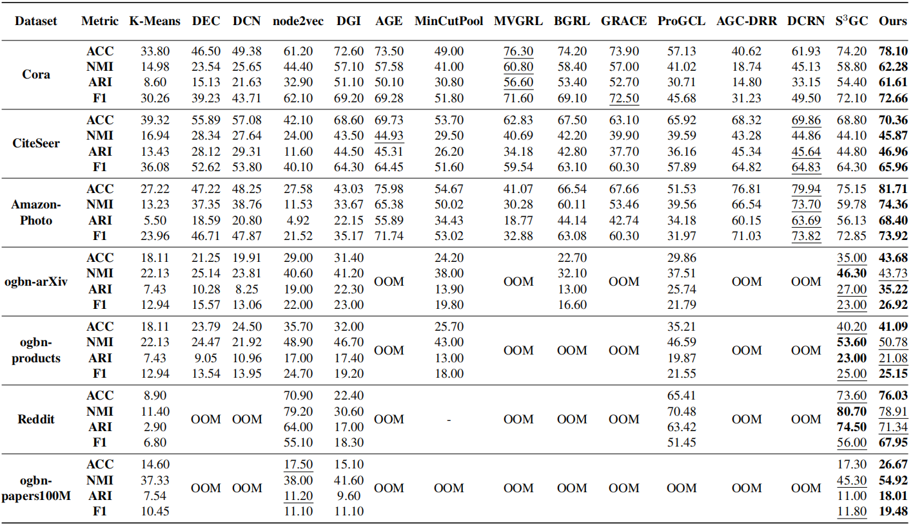

<div align="center">

<h2><a href="https://arxiv.org/pdf/2305.18405.pdf">Dink-Net: Neural Clustering on Large Graphs</a></h2>

[Yue Liu](https://yueliu1999.github.io/)<sup>1,2</sup>, [Ke Liang](https://liangke23.github.io/)<sup>1</sup>,  [Jun Xia](https://junxia97.github.io/)<sup>2</sup>, [Sihang Zhou](https://scholar.google.com/citations?user=p9Se8kYAAAAJ&hl=zh-CN&oi=ao/)<sup>1</sup>, [Xihong Yang](https://xihongyang1999.github.io/)<sup>1</sup>, [Xinwang Liu](https://xinwangliu.github.io/)<sup>1</sup>, [Stan Z. Li](https://scholar.google.com/citations?user=Y-nyLGIAAAAJ&hl=zh-CN&oi=ao)<sup>2</sup>

<sup>1</sup>[National University of Defense Technology](https://english.nudt.edu.cn/), <sup>2</sup>[Westlake University](https://westlake.edu.cn/)


</div>


<p align="center">  <a href="https://pytorch.org/" alt="PyTorch">
  </a> <a href="https://icml.cc/Conferences/2023" alt="Conference">  </a>
</p>

<p style="text-align:justify; text-justify:inter-ideograph;">
Deep graph clustering, which aims to group the nodes of a graph into disjoint clusters with deep neural networks, has achieved promising progress in recent years. However, the existing methods fail to scale to the large graph with million nodes. To solve this problem, a scalable deep graph clustering method (<i>Dink-Net</i>) is proposed with the idea of <u>di</u>lation and shri<u>nk</u>. Firstly, by discriminating nodes, whether being corrupted by augmentations, representations are learned in a self-supervised manner. Meanwhile, the cluster centers are initialized as learnable neural parameters. Subsequently, the clustering distribution is optimized by minimizing the proposed cluster dilation loss and cluster shrink loss in an adversarial manner. By these settings, we unify the two-step clustering, i.e., representation learning and clustering optimization, into an end-to-end framework, guiding the network to learn clustering-friendly features. Besides, <i>Dink-Net</i> scales well to large graphs since the designed loss functions adopt the mini-batch data to optimize the clustering distribution even without performance drops. Both experimental results and theoretical analyses demonstrate the superiority of our method.
</p>
 


[](https://github.com/yueliu1999/Dink-Net/stars)
[](https://github.com/yueliu1999/Dink-Net/forks)
[](https://github.com/yueliu1999/Dink-Net/issues)
[](https://github.com/yueliu1999/Dink-Net)

<details>
  <summary>Table of Contents</summary>
  <ol>
    <li><a href="#Usage">Usage</a></li>
    <li><a href="#acknowledgement">Acknowledgement</a></li>
    <li><a href="#citation">Citation</a></li>
  </ol>
</details>


## Usage

### Datasets

| Dataset         | Type            |   # Nodes   |    # Edges    | # Feature Dimensions | # Classes |
| --------------- | --------------- | :---------: | :-----------: | :------------------: | :-------: |
| Cora            | Attribute Graph |    2,708    |     5,278     |        1,433         |     7     |
| CiteSeer        | Attribute Graph |    3,327    |     4,614     |        3,703         |     6     |
| Amazon-Photo    | Attribute Graph |    7,650    |    119,081    |         745          |     8     |
| ogbn-arxiv      | Attribute Graph |   169,343   |   1,166,243   |         128          |    40     |
| Reddit          | Attribute Graph |   232,965   |  23,213,838   |         602          |    41     |
| ogbn-products   | Attribute Graph |  2,449,029  |  61,859,140   |         100          |    47     |
| ogbn-papers100M | Attribute Graph | 111,059,956 | 1,615,685,872 |         128          |    172    |

### Requirements
```
dgl==1.1.1
munkres==1.1.4
networkx==3.1
numpy==1.23.5
scikit_learn==1.2.1
scipy==1.10.0
torch==1.12.1
tqdm==4.64.1
```


### Configurations

```
--device     |  running device
--dataset    |  dataset name
--hid_units  |  hidden units
--activate   |  activation function
--tradeoff   |  tradeoff parameter
--lr         |  learning rate
--epochs     |  training epochs
--eval_inter |  evaluation interval
--wandb      |  wandb logging
```


### Quick Start

clone this repository and change directory to Dink-Net

```
git clone https://github.com/yueliu1999/Dink-Net.git
cd ./Dink-Net
```

unzip the datasets

```
unzip -d ./data/ ./data/datasets.zip
```

run codes with scripts

```
bash ./scripts/train_cora.sh

bash ./scripts/train_citeseer.sh

bash ./scripts/train_amazon_photo.sh
```

or directly run codes with commands

```
python main.py --device cpu --dataset cora --hid_units 512 --lr 1e-2 --epochs 200 --wandb

python main.py --device cpu --dataset citeseer --hid_units 1536 --lr 5e-4 --epochs 200 --wandb

python main.py --device cpu --dataset amazon_photo --hid_units 512 --lr 1e-2 --epochs 100 --wandb
```

tips: remove "--wandb" to disable wandb logging. 


### Results



<p style="text-align:justify; text-justify:inter-ideograph;">
Table 1. Clustering performance (%) of our method and fourteen state-of-the-art baselines. The bold and underlined values are the best and the runner-up results. “OOM” indicates that the method raises the out-of-memory failure. “-” denotes that the methods do not converge.
</p>


<p align="center">
    Figure 1. <i>t</i>-SNE visualization of seven methods on the Cora dataset.
</p>


## Acknowledgements

Our code are partly based on the following GitHub repository. Thanks for their awesome works. 
- [Awesome Deep Graph Clustering](https://github.com/yueliu1999/Awesome-Deep-Graph-Clustering): a collection of deep graph clustering (papers, codes, and datasets). 
- [Graph-Group-Discrimination](https://github.com/zyzisastudyreallyhardguy/Graph-Group-Discrimination): the official implement of Graph Group Discrimination (GGD) model.
- [S3GC](https://github.com/devvrit/S3GC): the official implement of Scalable Self-Supervised Graph Clustering (S3GC) model. 
- [HSAN](https://github.com/yueliu1999/HSAN): the official implement of Hard Sample Aware Network (HSAN) model.
- [DCRN](https://github.com/yueliu1999/DCRN): the official implement of Dual Correlation Reduction Network (DCRN) model.


## Citations

If you find this repository helpful, please cite our paper.

```
@inproceedings{Dink-Net,
  title={Dink-Net: Neural Clustering on Large Graphs},
  author={Liu, Yue and Liang, Ke and Xia, Jun and Zhou, Sihang and Yang, Xihong and Liu, Xinwang and Li, Stan Z.},
  booktitle={International Conference on Machine Learning},
  year={2023},
  organization={PMLR}
}
```

<p align="right">(<a href="#top">back to top</a>)</p>